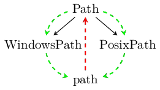
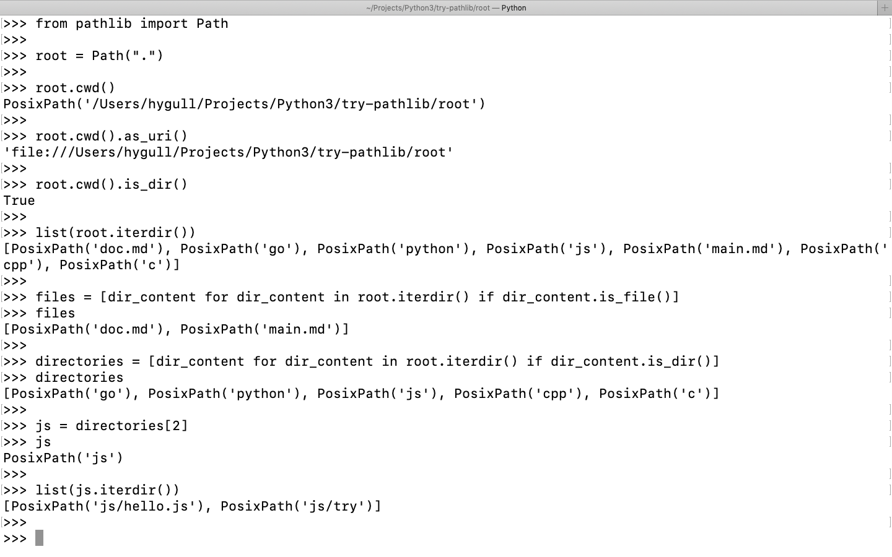

# Python's pathlib - usage examples

This documenation presents basic usage examples of Python's **pathlib** library. Before trying examples in this page make sure to check your Python version by reading the below note or [visit here](https://pypi.org/project/pathlib/?fbclid=IwAR0-Jk14-IkTLCNldiHXvv5HAzhE_C71YDMdv9vmfT0QtlILYZku_7gLKSM) to check.


## What it offers, what speciality it has?

**pathlib** offers a set of classes to handle filesystem paths. It offers the following advantages over using string objects:

+ No more cumbersome use of os and os.path functions. Everything can be done easily through operators, attribute accesses, and method calls.

+ Embodies the semantics of different path types. For example, comparing Windows paths ignores casing.

+ Well-defined semantics, eliminating any warts or ambiguities (forward vs. backward slashes, etc.).

| pathlib | inheritance |
| --- | --- |
| ||

## Note

+ Python **3.2** or later is recommended, but pathlib is also usable with Python **2.7** and **2.6**.

+ From Python **3.4**, pathlib is now part of the standard library. For Python **3.3** and earlier, `easy_install pathlib` or `pip install pathlib` should do the trick.


&raquo; Mean to say

| Python 2.6 - Python3.3 | >= Python 3.4 |
| --- | --- |
| `pip install pathlib` OR | No installation is required just try it |
| `easy_install pathlib` | Now it's the part of Python's standard library |

> Mine is Python **3.7.2** and I am trying it on **MAC OS Mojave**.


## Directory structure of working directory

We will be working on [root](./root) directory. This directory has the following structure.

```bash
Rishikeshs-MacBook-Air:try-pathlib hygull$ pwd
/Users/hygull/Projects/Python3/try-pathlib
Rishikeshs-MacBook-Air:try-pathlib hygull$ tree root/

```

```bash
root/
├── c
│   └── examples
│       ├── c-main.md
│       └── hello.c
├── cpp
│   ├── docs
│   │   └── notes.md
│   └── hello.cpp
├── doc.md
├── go
│   ├── docs
│   │   ├── links.md
│   │   └── loop.py
│   ├── hello.go
│   └── images
│       ├── go-slices-usage-and-internals_slice-2.png
│       ├── go.jpeg
│       ├── rishikesh.jpeg
│       └── rishikesh.png
├── js
│   ├── hello.js
│   └── try
│       └── examples
│           └── dict-example.py
├── main.md
└── python
    ├── examples
    │   └── go
    │       └── slice.go
    ├── hello.py
    └── images
        ├── python.jpeg
        └── rishikesh.webp

```

## Getting started

Now, let's move/navigate to **root** directory which is to be assumed as the working directory in this documentation.

```bash
Rishikeshs-MacBook-Air:try-pathlib hygull$ cd root/
Rishikeshs-MacBook-Air:root hygull$ ls
c	cpp	doc.md	go	js	main.md	python
Rishikeshs-MacBook-Air:root hygull$

```

```bash 
Rishikeshs-MacBook-Air:root hygull$ python3
Python 3.7.2 (default, Jan 13 2019, 12:50:01) 
[Clang 10.0.0 (clang-1000.11.45.5)] on darwin
Type "help", "copyright", "credits" or "license" for more information.
>>> 

```

We are done, let's start.



#### &raquo; Listing out directories and files of current directory separately

```python 
>>> from pathlib import Path
>>> 
>>> root = Path(".")
>>> root
PosixPath('.')
>>> 
```

```python
>>> directories = [dir_content for dir_content in root.iterdir() if dir_content.is_dir()]
>>> directories
[PosixPath('go'), PosixPath('python'), PosixPath('js'), PosixPath('cpp'), PosixPath('c')]
>>>
```

```python 
>>> files = [dir_content for dir_content in root.iterdir() if dir_content.is_file()]
>>> files
[PosixPath('doc.md'), PosixPath('main.md')]
>>> 

```

#### &raquo; Getting absoute path of `root` directory

```python
>>> root.absolute()
PosixPath('/Users/hygull/Projects/Python3/try-pathlib/root')
>>> 

```

#### &raquo; Getting `home` directory's absolute path

```python
>>> root.home()
PosixPath('/Users/hygull')

```

#### &raquo; Listing out all python files present in any of the directories availble under current directory

```python
>>> list(root.glob("**/*.py"))
[PosixPath('go/docs/loop.py'), PosixPath('python/hello.py'), PosixPath('js/try/examples/dict-example.py')]
>>> 


```


#### &raquo; Navigating to `root/python/examples/go` and lisiting out its content(s).

+ Brief look using terminal.

```bash
Rishikeshs-MacBook-Air:root hygull$ 
Rishikeshs-MacBook-Air:root hygull$ ls python/examples/
go
Rishikeshs-MacBook-Air:root hygull$ ls python/examples/go/
slice.go
Rishikeshs-MacBook-Air:root hygull$ cat python/examples/go/slice.go 
package main 

import "fmt"

func main() {
	a := []int{12, 5, 6, 8}
	fmt.Print(a)
}

```

+ Prgramatically navigating to `root/python/examples/go` by verifying the navigated location's existence.

```python
>>> root
PosixPath('.')
>>> 
>>> python = root / "python"
>>> python
PosixPath('python')
>>> 
>>> python.exists()
True
>>> 
>>> examples = python / "examples"
>>> examples
PosixPath('python/examples')
>>> 
>>> examples.exists()
True
>>> 
>>> go = examples / "go"
>>> go
PosixPath('python/examples/go')
>>> 
>>> go.exists()
True
>>> 

```

+ Lisiting out content(s) of **go** directory.

```python
>>> list(go.iterdir())
[PosixPath('python/examples/go/slice.go')]
>>> 
```

+ Single line to navigate to `go` directory - `go = root / "python" / "examples" / "go"`

```python
>>> examples = root / "examples"
>>> examples.exists()
False
>>> 
>>> examples = root / "python" / "examples"
>>> examples.exists()
True
>>> 
```

```python
>>> go = root / "python" / "examples" / "go"
>>> go.exists()
True
>>> 

```

#### &raquo; Getting URI

```python
>>> python
PosixPath('python')
>>> 
```

```python
>>> python.as_uri()
Traceback (most recent call last):
  File "<stdin>", line 1, in <module>
  File "/usr/local/Cellar/python/3.7.2_1/Frameworks/Python.framework/Versions/3.7/lib/python3.7/pathlib.py", line 714, in as_uri
    raise ValueError("relative path can't be expressed as a file URI")
ValueError: relative path can't be expressed as a file URI
>>> 
```

```python
>>> python = python.resolve()
>>> python
PosixPath('/Users/hygull/Projects/Python3/try-pathlib/root/python')
>>> 
```

```python
>>> python.as_uri()
'file:///Users/hygull/Projects/Python3/try-pathlib/root/python'
>>> 

```


#### &raquo; Printing parent directories and checking their existence

```python
>>> go = go.resolve()
>>> go.as_uri()
'file:///Users/hygull/Projects/Python3/try-pathlib/root/python/examples/go'
>>>

```

```python
>>> examples = go.parent
>>> examples
PosixPath('/Users/hygull/Projects/Python3/try-pathlib/root/python/examples')
>>> 
>>> examples.exists()
True
>>> 

```

```python
>>> python = examples.parent
>>> python
PosixPath('/Users/hygull/Projects/Python3/try-pathlib/root/python')
>>> 
>>> python.exists()
True
>>> 
```


### &raquo; Creating a directory with a file inside it with few lines

> The output of the below code is [created_files](./src/created_files) directory with [message.txt](./src/created_files/message.txt) file inside it.

```python
"""
    {
        "date_created": "2 march 2019, Sat",
        "aim": "Creating files with contents (few lines)",
        "created_by": "Rishikesh Agrawani",
        "description": "First the code will check if there is a directory 
                        named `created_files` in the current working directory
                        if it exists, it will create files inside that
                        it it doesn't exist, create the folder first and then create file
                        named `message.txt` inside that"

    }
"""

from pathlib import Path 


cwd = Path(".")
created_files_dir = cwd / "created_files"

if not created_files_dir.exists():
    created_files_dir.mkdir()

file = created_files_dir / "message.txt"

lines = [
    "It is better to learn programming for solving complex problems.",
    "Python, Java, Go, C, JavaScript, Ruby, PHP are popular.",
    "So finally, we all are in a right place"
]

file.write_text('\n'.join(lines))
```


## Help

```python
>>> from pathlib import Path
>>> 
>>> root = Path(".")
>>> 
>>> dir(root)
['__bytes__', '__class__', '__delattr__', '__dir__', '__doc__', '__enter__', '__eq__', '__exit__', '__format__', '__fspath__', '__ge__', '__getattribute__', '__gt__', '__hash__', '__init__', '__init_subclass__', '__le__', '__lt__', '__module__', '__ne__', '__new__', '__reduce__', '__reduce_ex__', '__repr__', '__rtruediv__', '__setattr__', '__sizeof__', '__slots__', '__str__', '__subclasshook__', '__truediv__', '_accessor', '_cached_cparts', '_closed', '_cparts', '_drv', '_flavour', '_format_parsed_parts', '_from_parsed_parts', '_from_parts', '_hash', '_init', '_make_child', '_make_child_relpath', '_opener', '_parse_args', '_parts', '_pparts', '_raise_closed', '_raw_open', '_root', '_str', 'absolute', 'anchor', 'as_posix', 'as_uri', 'chmod', 'cwd', 'drive', 'exists', 'expanduser', 'glob', 'group', 'home', 'is_absolute', 'is_block_device', 'is_char_device', 'is_dir', 'is_fifo', 'is_file', 'is_mount', 'is_reserved', 'is_socket', 'is_symlink', 'iterdir', 'joinpath', 'lchmod', 'lstat', 'match', 'mkdir', 'name', 'open', 'owner', 'parent', 'parents', 'parts', 'read_bytes', 'read_text', 'relative_to', 'rename', 'replace', 'resolve', 'rglob', 'rmdir', 'root', 'samefile', 'stat', 'stem', 'suffix', 'suffixes', 'symlink_to', 'touch', 'unlink', 'with_name', 'with_suffix', 'write_bytes', 'write_text']
>>> 
>>> help(root)

>>> help(root.exists())
>>> 
>>> help(root.as_uri)

>>> 

```

## Screenshots

[ScreenShot2019-03-02at8.26.27AM.png](./images/linkedin-article/ScreenShot2019-03-02at8.26.27AM.png)

[ScreenShot2019-03-02at9.31.17AM.png](./images/linkedin-article/ScreenShot2019-03-02at9.31.17AM.png)

[ScreenShot2019-03-02at12.31.04PM.png](./images/linkedin-article/ScreenShot2019-03-02at12.31.04PM.png)

[ScreenShot2019-03-02at2.25.17PM.png](./images/linkedin-article/ScreenShot2019-03-02at2.25.17PM.png)

[ScreenShot2019-03-02at2.40.59PM.png](./images/linkedin-article/ScreenShot2019-03-02at2.40.59PM.png)

[ScreenShot2019-03-02at3.20.25PM.png](./images/linkedin-article/ScreenShot2019-03-02at3.20.25PM.png)

[ScreenShot2019-03-02at3.33.55PM.png](./images/linkedin-article/ScreenShot2019-03-02at3.33.55PM.png)

[ScreenShot2019-03-02at3.47.52PM.png](./images/linkedin-article/ScreenShot2019-03-02at3.47.52PM.png)


## References

+ [https://python.readthedocs.io/en/stable/library/pathlib.html](https://python.readthedocs.io/en/stable/library/pathlib.html)

+ [https://pypi.org/project/pathlib/?fbclid=IwAR0-Jk14-IkTLCNldiHXvv5HAzhE_C71YDMdv9vmfT0QtlILYZku_7gLKSM](https://pypi.org/project/pathlib/?fbclid=IwAR0-Jk14-IkTLCNldiHXvv5HAzhE_C71YDMdv9vmfT0QtlILYZku_7gLKSM)

+ [https://realpython.com/python-pathlib/](https://realpython.com/python-pathlib/)
